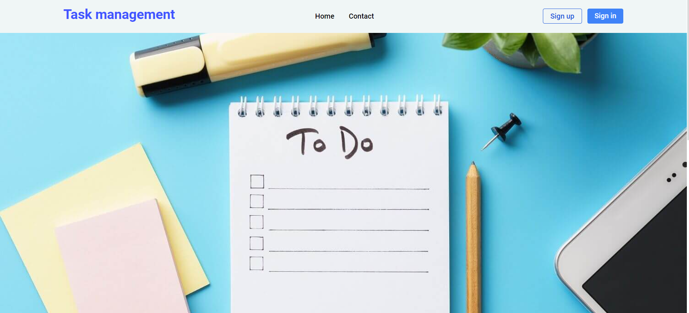
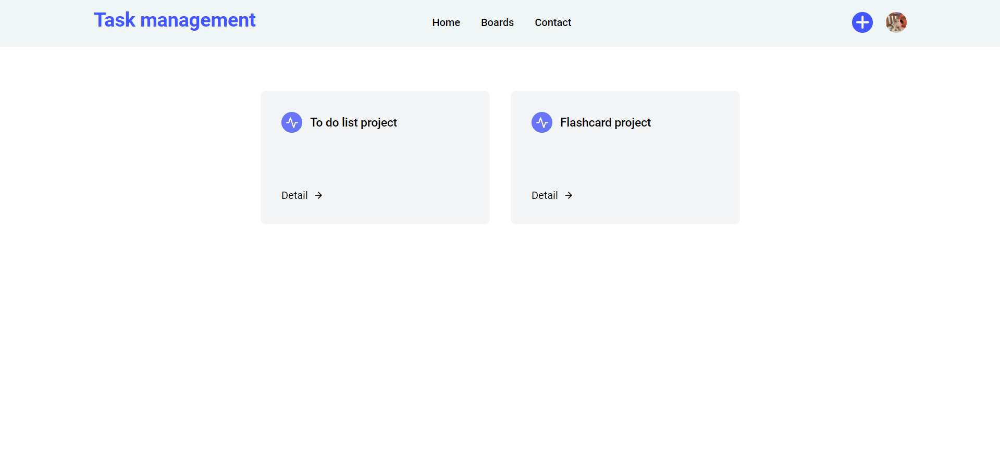
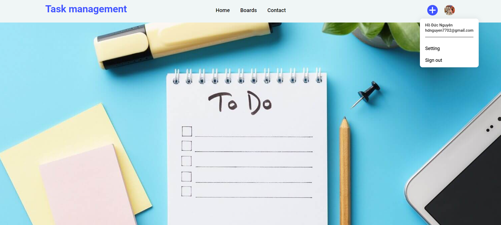
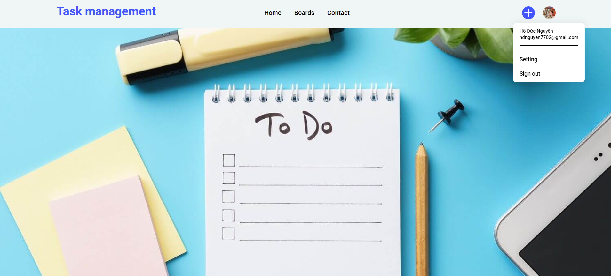

<h1 align="center">Đồ án Vue JS
 
    Task management
</h1>

    

# [**Table Of Content**](#table-of-content)
- [**Table Of Content**](#table-of-content)
- [**Introduction**](#introduction)
- [**Topic**](#topic)
- [**Database**](#database)
- [**Authenticate**](#authenticate)
- [**Feature**](#feature)
  - [**1. Sign in**](#1-sign-in)
  - [**2. Sign Up**](#2-sign-up)
  - [**3. Remember me**](#3-remember-me)
  - [**4. Recovery Password**](#4-recovery-password)
  - [**5. Home**](#5-home)
  - [**6. Contact**](#6-contact)
  - [**7. Create board**](#7-create-board)
  - [**8. Detail board**](#8-detail-board)
  - [**9. Setting**](#9-setting)
  - [**10. Logout**](#10-logout)
- [**Responsive**](#responsive)
# [**Introduction**](#introduction)

Mình là `Hồ Đức Nguyên`. Sinh viên `Học Viện Công Nghệ Bưu Chính Viễn Thông`, Mã số `N20DCCN047`, Niên khóa `2020-2025`.
Lời đầu tiên mình xin chào và cảm ơn tất cả những ai đang ở đây. Trong tài liệu này mình sẽ chia sẻ tất cả những gì mình làm trong đồ án.
# [**Topic**](#topic)

Có thể giải thích đồ án ngắn gọn như sau:

**Website** - Ứng dụng `task management`  giúp người dùng tổ chức và quản lý công việc một cách hiệu quả. Dưới đây là một số công dụng chính:
1. Tổ chức công việc: Ứng dụng task management giúp người dùng tạo ra danh sách công việc cần làm, phân chia chúng thành các mục và đặt thời hạn cho từng công việc.
2. Quản lý thời gian: Bằng cách gán thời hạn và ưu tiên cho các công việc, người dùng có thể quản lý thời gian của mình một cách hiệu quả hơn.
3. Theo dõi tiến độ: Các ứng dụng task management cho phép người dùng theo dõi tiến độ hoàn thành công việc, từ đó giúp họ biết được mình đang làm việc vào thời điểm nào và có thể điều chỉnh kế hoạch làm việc theo cách phù hợp.
4. Lập kế hoạch dài hạn: Bằng cách sắp xếp và lập kế hoạch cho các công việc trong tương lai, người dùng có thể dễ dàng lập kế hoạch dài hạn cho dự án hoặc mục tiêu cá nhân.
5. Giao tiếp và chia sẻ công việc: Một số ứng dụng cho phép người dùng chia sẻ danh sách công việc và tương tác với nhóm làm việc, từ đó giúp tăng cường sự hợp tác và hiệu suất làm việc ( Phát triển trong tương lai )

Giải thích vậy là cũng khá dễ hiểu rồi. Giờ chúng ta sẽ tiếp tục xem qua sơ bộ cơ sở dữ liệu nhé.

# [**Database**](#database)

Database được sử dụng trong đồ án là `Firestore Database`, là một dịch vụ cơ sở dữ liệu linh hoạt và mạnh mẽ được cung cấp bởi `Firebase`, nền tảng phát triển ứng dụng của Google. `Firestore Database` được thiết kế để cung cấp một cơ sở dữ liệu `NoSQL thời gian thực`, có khả năng mở rộng và dễ sử dụng cho việc xây dựng các ứng dụng di động, web và các dịch vụ đám mây.

`Firestore Database` cung cấp dịch vụ cơ sở dữ liệu thời gian thực, cho phép dữ liệu được đồng bộ hóa trên các máy khách trong thời gian thực.

Tớ sẽ giải thích qua về ý nghĩa các `collection` xuất hiện trong `Firestore Database` nha.

**Collection Boards** - collection này chứa thông tin về tasks được phân loại theo tiêu chí của người dùng.
    
- name(String): Tên của thư mục tasks 
- createAt (String): Thời gian người dùng tạo ra thư mục tasks
- description (String): Mô tả thêm về thư mục tasks 
- members(Array lưu String): Uid thành viên tham gia vào thư mục tasks 
- tasks (Array lưu Object): task thuộc thư mục
    - name (String): Tên của task
    - owners (Array): Thành viên được giao task 
    - priority (Number): Độ ưu tiên của task (1 => 5)
    - dueDate (String): Ngày đến hạn của task 
    - status (String): Trạng thái của task (notStarted, inProgress, done)

# [**Authenticate**](#authenticate)

Authenticate được sử dụng trong đồ án là `Authenticate Firebase`, là một dịch vụ cung cấp bởi `Firebase`, nền tảng phát triển ứng dụng của Google, nhằm cung cấp tính năng xác thực người dùng trong các ứng dụng di động, web và các ứng dụng khác. Dịch vụ này giúp cho việc quản lý và xác thực người dùng trở nên dễ dàng và an toàn hơn.

**Email/Password** - Cho phép người dùng đăng ký, đăng nhập vào tài khoản với email và password

# [**Feature**](#feature)

Giờ thì mình sẽ giới thiệu cho các bạn toàn bộ chức năng chính của đồ án này nha.

## [**1. Sign in**](#1-sign-in)

    

<h3 align="center">

**Chức năng đơn giản nhưng quan trọng với mọi website**
</h3>

Đăng nhập là chức năng mà mọi lập trình viên đều phải biết làm dù là phục vụ cho website hoặc ứng dụng
di động. Có lẽ không phải nói nhiều nữa🥱. Mình sẽ tiếp tục.

## [**2. Sign Up**](#2-sign-up)

Có đăng nhập thì dĩ nhiên là phải có đăng ký rồi. Tính năng này thì chẳng có gì lạ lẫm với các bạn cả.

    

## [**3. Remember me**](#3-remember-me)

Người dùng không muốn mỗi lần kết thúc session lại phải đăng nhập lại, đừng lo! Website này hỗ trợ bạn không phải đăng nhập cho lần truy cập sau.

    

<h3 align="center">

**Click vào Remember me 😎**
</h3>

## [**4. Recovery Password**](#4-recovery-password)

Bạn bị bệnh não cá vàng 🐠? Bạn hay làm trước quên sau ? Lần này thì quên luôn mật khẩu mình vừa mới tạo. Đừng lo ! Website này hỗ trợ luôn trường hợp bạn quên mật khẩu. Chỉ cần nhập đúng email bạn đã đăng kí tài khoản tại `Task management`

    

<h3 align="center">

**Kiểm tra Gmail thôi nào 🤗🤩**
</h3>

BÙM 🔥🔥🔥 Ngạc nhiên chưa !! Click vào đường link để tạo mật khẩu mới

    

<h3 align="center">

## [**5. Home**](#5-home)

Giới thiệu về website

    

    

## [**6. Contact**](#6-contact)

    

## [**7. Create board**](#7-create-board)

Tạo thư mục chứa task theo tiêu chí người dùng  

    

<h3 align="center">

**Tên của thư mục là không được để trống nhé 🤗**
</h3>

    

<h3 align="center">

**Toàn bộ thư mục task, bây giờ hãy vào chi tiết của thư mục task nhé 🤗**
</h3>

## [**8. Detail board**](#8-detail-board)

Chi tiết của thư mục task có rất nhiều chức năng, Nhưng giao diện trực quan nên các bạn nhìn vào rất là dễ hiểu 

    

<h3 align="center">

**Màn hình tổng quan về chi tiết thư mục task, bây giờ đi vào từng chi tiết cụ thể nhé 🤗**
</h3>

**Hiệu chỉnh tên thư mục task** => click vào tên của thư mục

    

**Xóa thư mục task** => click vào icon Delete

Website sẽ xác nhận lại bạn có thực sự muốn xóa đi thư mục task này không

    

**Thêm task** => click vào icon + ở dưới table task

Người dùng điền tên task và thông tin cơ bản Owner, Priority, Due Date, Status

**Hiệu chỉnh task** => click vào item tương ứng

## [**9. Setting**](#9-setting)

Click vào ảnh đại diện của người dùng nhé

    

**Chi tiết setting**

    

**Thay đổi password** 

    

**Xóa tài khoản**

    

## [**10. Logout**](#10-logout)

    

<h3 align="center">

**Có đăng nhập thì tất nhiên phải có đăng xuất 🤗**
</h3>

# [**Responsive**](#responsive)

**Giao diện được thiết kế tương thích với nhiều màn hình từ laptop, tablet, mobile**

***Đăng nhập***

    

***Đăng ký***

    

***Quên mật khẩu***

    

***Trang chủ***

    

***Tạo thư mục task***

    

***Toàn bộ thư mục task***

    

***Chi tiết thư mục task***

    

***Chi tiết setting***

    

***Thay đổi mật khẩu***

    

***Xóa tài khoản***

    

    
